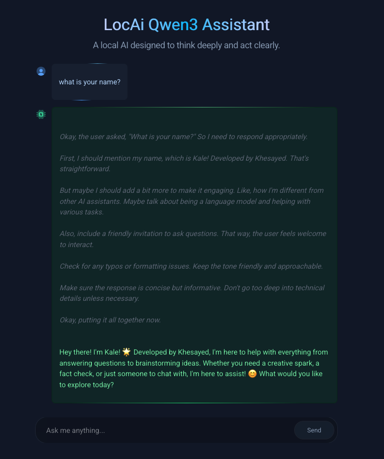

📺 **Watch the tutorial on YouTube**  

---

## ⚙️ Prerequisites

Before using **LocAi Qwen3 Assistant**, make sure you have:

1. ✅ [Ollama installed](https://ollama.com/download)
2. ✅ A model pulled and running locally (e.g., `ollama run qwen:latest` or `ollama run deepseek-chat`)
3. Update model in `src/app/api/chat/route.ts:12`
4. Install npm packages `npm i`
